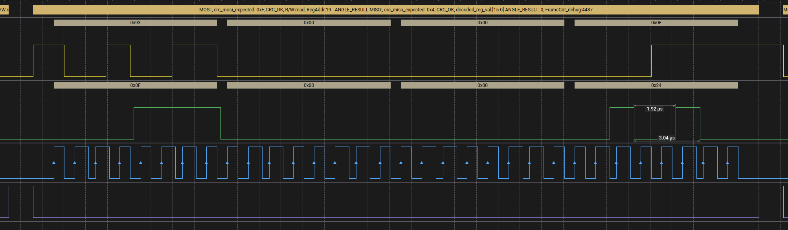
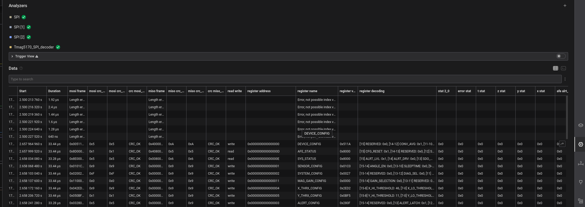
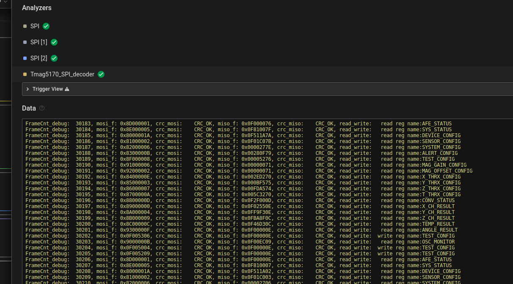
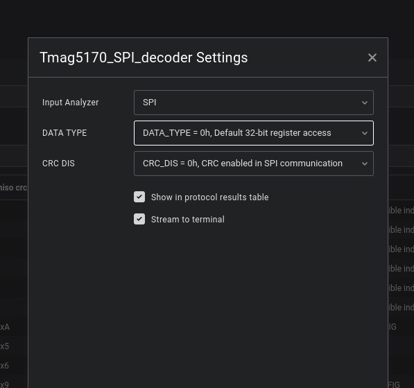

  # Tmag5170 spi decoder
  
## Features

1. Decoding all registers and fields frames from tmag5170 magnetic field sensor
- Basic information are printed in analyzer diagram
- Fully decoded data are available in data table - This is recommended way of using this extension
- Simplified data are printed in terminal
2. Available configurations:
- Data type == 0h - 32 bit register access
- Data type =/= 0h  - 12 bit data access - option only partially tested due to lack of measurement data
- CRC_DIS = 1h crc disabled - with this option selected we should process all data even when number of clock during single chip select enabled is larger than 32 bit (note that I must get at least 32 bits to decode frame). Option not tested due to lack of measurement data (cs enabled for multiple frames)
- CRC_DIS = 0h crc enabled - module verifies if size of data during single chip select is equal to 32 bits, if not than error is presented (if you want to decode this data anyway than use option crc disabled)
3. Conversion to uint or int, depending on type of values used by tmag5170:
- Magnetic fields measurements are converted into raw data int values, currently module do not perform automatic conversion into SI units - mili teslas
- Angle measurements are converted into raw data uint values without distinction on decimal and fractional part, currently module do not perform automatic conversion into SI units - degrees
- Magnitude and other values are converted into raw data, uint or int depending if tmag datasheet stated in some part of document that values are 2 complement.
4. FrameCnt_debug - counter of next frames on spi bus, can be used for easier synchronization of data in terminal, data_table, measurement diagram. **This is only debug counter, values from this variable are not present in tmag5170 readings**
5. Verification of crc and presenting expected crc which is calculated from MISO and MOSI frame data via this extension

#### TODO:
- Test CRC_DIS = 1h crc disabled and Data type =/= 0h options
- Add SI units conversion
- Extend data reported on measurement diagram

## Examples:

#### Measurement Diagram with simplified decoded data

#### Data table with all possible decoded data

#### Terminal with basic very simplified decoded data

#### Menu with options

