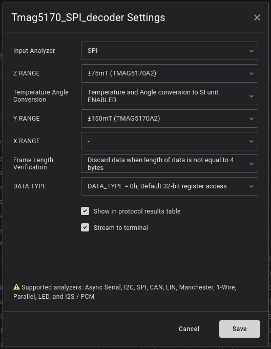

  # Tmag5170 spi decoder
  
## Features

1. Decoding all registers and fields frames from tmag5170 magnetic field sensor
- Basic information are printed in analyzer diagram
- Fully decoded data are available in data table - This is recommended way of using this extension
- Simplified data are printed in terminal
2. Available configurations:
- Data type == 0h - 32 bit register access
- Data type =/= 0h  - 12 bit data access - select proper option to get correct type casting int/uint and for proper decoding to SI units [option not tested due to lack of data]
- Frame_length_verification - Discard data when length of data is not equal to 4 bytes
- Frame_length_verification - Try to decode next frames when length is at least 4 bytes - If chipselect will be held for multiple frames all data will be decoded [option not tested due to lack of data]
- X_RANGE/Y_RANGE/Z_RANGE - select proper range if you want to decode magnetic field to mT. Only static configuration handled.
- Temperature_Angle_Conversion - conversion of temp to SI units ENABLED or DISABLED
3. Conversion to uint or int, depending on type of values used by tmag5170:
- Magnetic fields measurements are converted into raw data int values, currently module do not perform automatic conversion into SI units - mili teslas
- Angle measurements are converted into raw data uint values without distinction on decimal and fractional part, currently module do not perform automatic conversion into SI units - degrees
- Magnitude and other values are converted into raw data, uint or int depending if tmag datasheet stated in some part of document that values are 2 complement.
4. FrameCnt_debug - counter of next frames on spi bus, can be used for easier synchronization of data in terminal, data_table, measurement diagram. **This is only debug counter, values from this variable are not present in tmag5170 readings**
5. Verification of crc and presenting expected crc which is calculated from MISO and MOSI frame data via this extension
6. Most of data have possibility of decoding to SI units

#### TODO:
- Test Frame_length_verification - Try to decode next frames when length is at least 4 bytes
- Test Data type =/= 0h

## Examples:

#### Measurement Diagram with simplified decoded data

#### Data table with all possible decoded data

#### Terminal with basic very simplified decoded data

#### Menu with options

